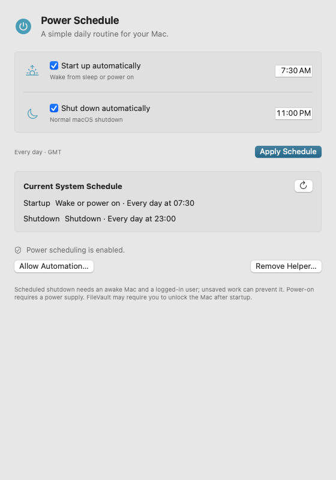

# MacPowerScheduler

**A daily startup and shutdown routine for your Mac.**

Choose when your Mac wakes or powers on, when it shuts down, or both. MacPowerScheduler provides a native macOS interface and a CLI for scripts, with the current system schedule always visible.



## What it does

- Set independent daily startup and shutdown times.
- Wake a sleeping Mac or power on a shut-down Mac where supported by the hardware.
- Keep the schedule running with the app closed—macOS owns and executes it.
- Inspect existing schedules and explicitly replace schedules the daily editor cannot represent.
- Automate changes through the bundled CLI, with JSON output and revocable account access.

MacPowerScheduler manages the system's single repeating schedule. One-time power events are preserved. Weekday editing, multiple profiles, and forced shutdown are outside its current scope.

## Getting started

Requires **macOS 14 or later**. Builds for **Intel and Apple Silicon**. Tested on an **Intel Mac mini running macOS 15.7.4**; other hardware and macOS versions have not been verified.

Download **v0.1.2 (pre-release)**:

| Download | Macs supported |
| --- | --- |
| [Universal](https://github.com/aruffolo/MacPowerScheduler/releases/download/v0.1.2/MacPowerScheduler-macos-universal-0.1.2.zip) | Intel and Apple Silicon |
| [Apple Silicon only](https://github.com/aruffolo/MacPowerScheduler/releases/download/v0.1.2/MacPowerScheduler-macos-arm64-0.1.2.zip) | Apple Silicon; smaller download |

Both downloads are Developer ID signed and notarized by Apple. See the [release notes](https://github.com/aruffolo/MacPowerScheduler/releases/tag/v0.1.2) for validation limits and debug symbols, and [SHA256SUMS](https://github.com/aruffolo/MacPowerScheduler/releases/download/v0.1.2/SHA256SUMS) for ZIP checksums.

Extract the downloaded ZIP, then:

1. Move **MacPowerScheduler.app** into **Applications** and open it.
2. Select **Enable Power Scheduling** in the setup banner or **Settings** (the top-right gear, also Command-comma). If approval is required, select **Open System Settings**; macOS handles service approval and administrator authentication.
3. Enable startup, shutdown, or both, choose the times, and select **Apply Schedule**.
4. Check **Saved on this Mac** for the verified result. The footer distinguishes saved settings from unsaved edits.

Both switches off clears the repeating schedule when you apply. Times repeat daily in the Mac's local timezone.

If another tool changes the schedule while you are editing, select **Reload Editor** to review the new settings before applying. Unsaved edits survive temporary read failures; Apply stays disabled until the schedule can be read again.

Building your own copy? See [Build from source](#build-from-source). A default source build supports read-only inspection; scheduling requires an Apple-issued signing identity.

## CLI and automation

The CLI is included inside the app. Reading the schedule does not require the helper or automation permission:

```sh
/Applications/MacPowerScheduler.app/Contents/MacOS/powerschedulectl status --json
```

To allow scripts to change the schedule, open **Settings** and select **Allow Automation…**. Then, for example:

```sh
/Applications/MacPowerScheduler.app/Contents/MacOS/powerschedulectl set --startup 07:30 --shutdown 23:00
```

Omitting one side preserves its existing setting. CLI times use 24-hour `HH:mm` format. The CLI works with the app closed and never asks for a password.

Automation access applies to your local account: **any process running as that account can invoke the CLI to change the schedule**. Revoke access in the app whenever you no longer need it.

See the [CLI reference](docs/cli.md) for commands, JSON output, conflict handling, and exit codes.

## Things to know

Scheduled shutdown requires an awake Mac and a logged-in user; unsaved documents can prevent it. MacPowerScheduler does not force applications to quit. Power-on requires connected power and compatible hardware. With FileVault enabled, someone may need to unlock the Mac before services are reachable.

The app does not change FileVault, automatic login, or networking settings. See [Apple's scheduling guidance](https://support.apple.com/guide/mac-help/schedule-your-mac-to-turn-on-or-off-mchl40376151/mac) and the project's [security model](docs/security.md).

### Removing the app

**Removing the helper does not clear the system schedule.** To stop repeating events, first turn both switches off and apply. Then open **Settings** and select **Remove Helper…** to revoke automation access for all accounts and unregister the helper, before deleting the app.

Deleting the app or disabling its background item alone does not clear saved automation grants. If you already deleted the app, reinstall a matching signed copy to use its removal flow. One-time events are left intact.

## Build from source

Use Xcode 26.3 / Swift 6.2.4 and install the development tools:

```sh
brew install swiftlint swiftformat
make build
make run
```

You can also open `MacPowerScheduler.xcworkspace` in Xcode. The Debug app is built at `.build/DerivedData/Build/Products/Debug/MacPowerScheduler.app`.

The app has no third-party runtime dependencies. Swift Testing and test-only Point-Free SnapshotTesting cover logic and appearance; default tests do not modify your power schedule or install the helper.

## Contributing

Pull requests are welcome, from small fixes to substantial features. **You do not need to open an issue first.** Explain the problem your change solves and how you tested it.

See [CONTRIBUTING.md](CONTRIBUTING.md) for setup, signing, tests, and review guidance. Technical references: [architecture](docs/architecture/overview.md), [security](docs/security.md), [testing](docs/testing/README.md), and [release packaging](docs/release/README.md).

## License

[MIT](LICENSE).
