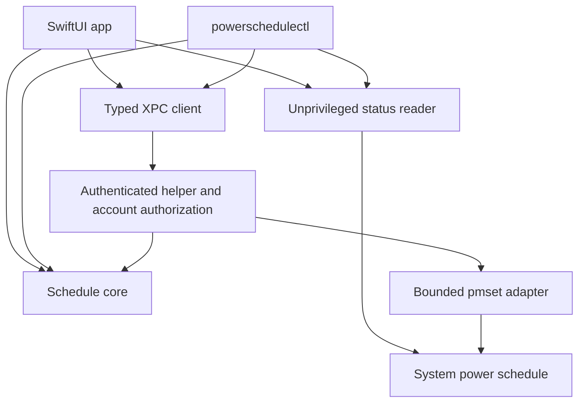

# MacPowerScheduler architecture

Implemented under initial-release plan revision `R2`, with the [Quiet Agenda presentation](../plans/quiet-agenda-ui/documentation.md). Product decisions live in [documentation.md](../plans/initial-release/documentation.md), contracts in [plan.md](../plans/initial-release/plan.md), and current validation status in [progress.md](../plans/initial-release/progress.md#resume-here).

## Repository structure

Adopt TetrisMac's workspace/app/package/tooling layout and Liquore's separation of models, interfaces, and adapters. Avoid copying either project's domain-specific tooling or large feature graph.

```text
MacPowerScheduler.xcworkspace
MacPowerScheduler.xcodeproj
App/                              # Thin SwiftUI app and composition root
Helper/                           # Privileged daemon executable entry point
CLI/                              # powerschedulectl executable entry point
Configurations/                   # Shared deployment/signing/build configuration
Package/
  Package.swift
  Sources/
    PowerScheduleCore/            # Values, validation, intents, pure policy
    PowerScheduleSystem/          # pmset read adapter, parser, bounded process runner
    PowerScheduleIPC/             # Typed XPC DTOs/protocol and client
    PowerScheduleService/         # Helper policy, authorization, serialized mutations
    PowerScheduleUI/              # Editor state and native views
    PowerScheduleCLI/             # CLI parsing/output and application layer
  Tests/                          # Swift Testing unit, adapter, snapshot suites and signed peer probe
Tools/                            # Build/release/explicitly opted-in validation tools
docs/
  architecture/overview.md
  plans/initial-release/          # Five-file restartable plan
  release/                        # Packaging procedure and release receipts
Makefile
README.md
LICENSE
```

Xcode owns executable packaging, entitlements, embedded helper/CLI signing, and app assembly. SwiftPM owns shared library logic and unit, adapter and snapshot tests. App, helper, and CLI are separate executable targets. The IPC target does not execute commands. Keep subfolders rather than adding more targets unless an actual dependency/security boundary warrants one.

## Dependency and process boundaries

The core imports neither SwiftUI, ServiceManagement, nor process/XPC execution. UI and CLI depend on core values and injected service interfaces. Their composition roots supply the system reader and IPC client. The helper combines core policy, typed IPC, authorization, and the bounded system adapter. Use initializer injection and pure transformation functions; no global service locator.

Internal injection separates process execution, XPC transport, account resolution and platform lifecycle from deterministic orchestration. Signing-requirement construction and grant-file metadata validation are pure policies; actual Security/OpenDirectory/POSIX checks stay in live adapters. Public production initializers retain those live implementations and mandatory trust checks. The editor accepts a calendar for deterministic clock tests while production follows the current system calendar. See [unit-test scope and integration boundaries](../testing/unit-coverage.md).



The app registers an embedded `SMAppService` LaunchDaemon. Follow Apple's bundle layout and verify the built bundle, rather than manually installing arbitrary daemon files. The CLI is bundled with the app; documentation exposes its invocation and an optional explicit PATH-link installation step. No privileged global CLI installation is needed for ordinary use.

## System state and mutations

Read `/usr/bin/pmset -g sched` under a controlled locale/environment. Parse the repeating section separately from one-time events. Represent missing, understood-but-not-editable, and unrecognized states distinctly. Keep type/day mask/seconds from the system snapshot even though new editor values are daily and minute-based. For the lossy `Some days` label only, read the repeating pair from `/Library/Preferences/SystemConfiguration/com.apple.AutoWake.plist`, the storage path documented by `pmset(1)`. Validate size, schema, event type, time and day masks; fail closed on mismatch. Never write preferences or call private IOKit APIs.

All mutations enter the helper as typed schedule intents with an expected snapshot and explicit replacement acknowledgement when needed. The helper validates the real caller, checks authorization, serializes its own requests, re-reads system state, compares the snapshot, merges any partial CLI edit, builds the complete repeating pair, and executes `/usr/bin/pmset` with a validated argument array. Both disabled maps to `repeat cancel`, never one-time-event cancellation.

Read back after a write before reporting success. A nonzero exit, timeout, lost connection, or mismatched readback is a distinct error or uncertain result. Re-read before retrying an uncertain write. Never blindly restore a stale snapshot. `pmset` offers no transactional compare-and-swap against external tools; pre/post verification reduces but cannot eliminate that race. Document it rather than promise atomic ownership across all programs.

The operating system persists and executes the schedule. No app-owned scheduler database mirrors its truth. App preferences may remember unsaved editor convenience values; automation authorization is separate helper-owned state. Daily times use the Mac's local wall clock and system DST behavior; avoid claiming a calculated next occurrence is guaranteed.

## Security and authorization

Peer identity and user authorization are separate. Require expected signing identities/identifiers on both XPC directions, using public APIs. A valid signature alone does not grant every local account write access. Derive account identity from the actual connection, never a user ID in the request payload. Keep per-connection authorization state isolated and validate all IPC types/ranges in the helper.

GUI changes use system-managed authorization when needed. Automation enrollment/revocation requires an authenticated user action. A helper-owned, access-controlled grant enables noninteractive writes for the enrolled account only; re-check grants at mutation time, including on existing connections after revocation. The implemented root-owned grant store binds grants to OpenDirectory account GUIDs. Signed runtime validation requirements belong to the release plan; current evidence belongs to progress. GUI authorization uses the asynchronous system API and retains its authorization lease until the helper replies.

The service exposes schedule read/replace/partial-edit and authorized automation management operations, not an executable runner. Limit process output/time, sanitize inherited environment, and avoid logging credentials or unsanitized diagnostics. CLI scripts fail promptly with structured actionable errors when authorization requires interaction.

Removing the helper revokes its grants but does not silently remove the system schedule. The removal flow explains that scheduled events can survive app removal and offers an explicit clear-first action. Upgrade/re-registration must handle version mismatch without running unrestricted fallback commands.

## Compatibility and source builds

`SMAppService` and the selected `NSXPCConnection` signing requirement APIs have a macOS 13 lower bound. The implemented SwiftUI model uses Observation (macOS 14), setting the final deployment target to macOS 14. Do not claim a runtime test merely because deployment-target compilation succeeds.

Use the installed Xcode/Swift toolchain, Swift Testing for deterministic logic, and test-only Point-Free SnapshotTesting for SwiftUI rendering. The app wrapper owns live refresh; the Quiet Agenda screen and Settings sheet share one model. View-local state owns presentation. `AgendaTimePicker` bridges native `NSDatePicker` through `NSViewRepresentable` for time editing; scheduling decisions remain in the model. Only the snapshot harness uses NSHostingView. Signed integration probes and manual packaged-app checks cover process/bundle identity. Use strict concurrency checks, with platform-specific code behind interfaces. No third-party runtime dependency is introduced.

Published binaries use Developer ID signing, hardened runtime, notarization, and ticket validation. A contributor signing configuration must keep peer checks meaningful with the contributor's identity. Unsigned builds can exercise pure tests and read-only logic; successful privileged source-build setup is a separate feasibility gate, not a promised unsigned-root mode.

## Operational risks and decision references

Global schedule replacement, parser drift, cold-start hardware differences, blocked shutdown, revoked helper approval, CLI privilege grants, source-build trust, upgrade/removal, and signing availability are covered by `REG-*`, `AG-*`, and Phase 0 spikes in the plan.

References: `DEC-1` through `DEC-10`, `INT-1` through `INT-3`, and `Q-1` through `Q-4` in the decision log. This document describes the implemented component design; it does not define validation checks or record test results.
