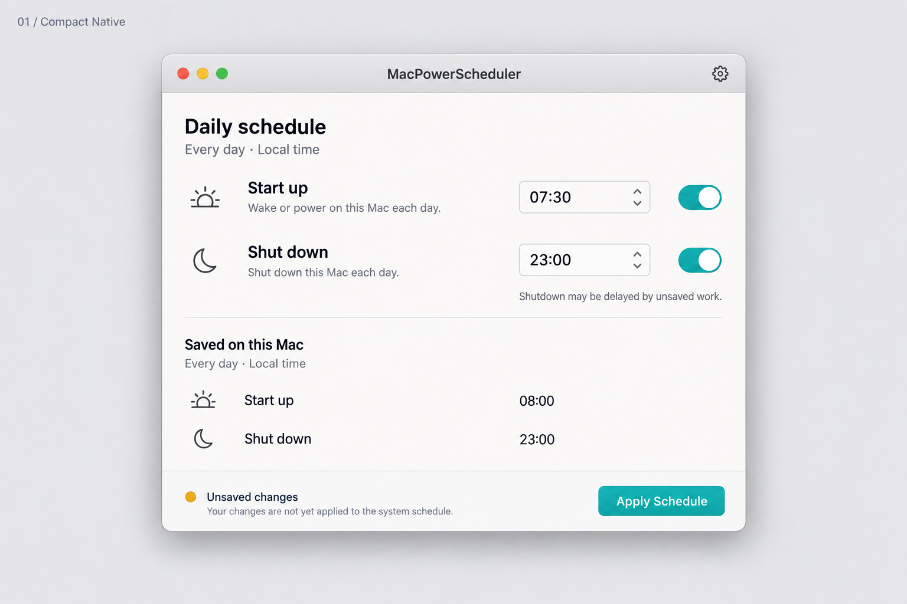
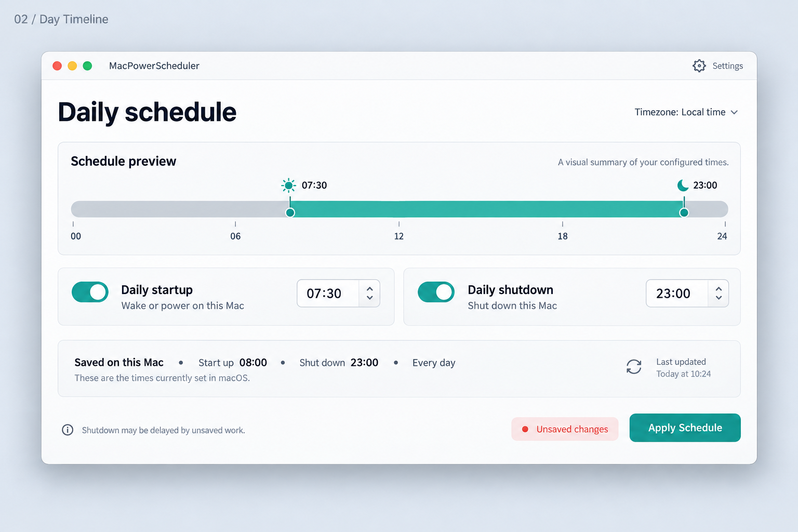
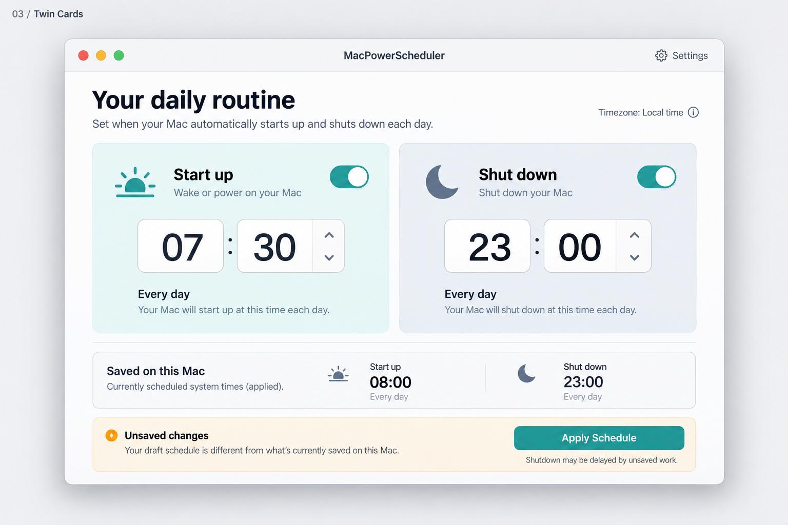
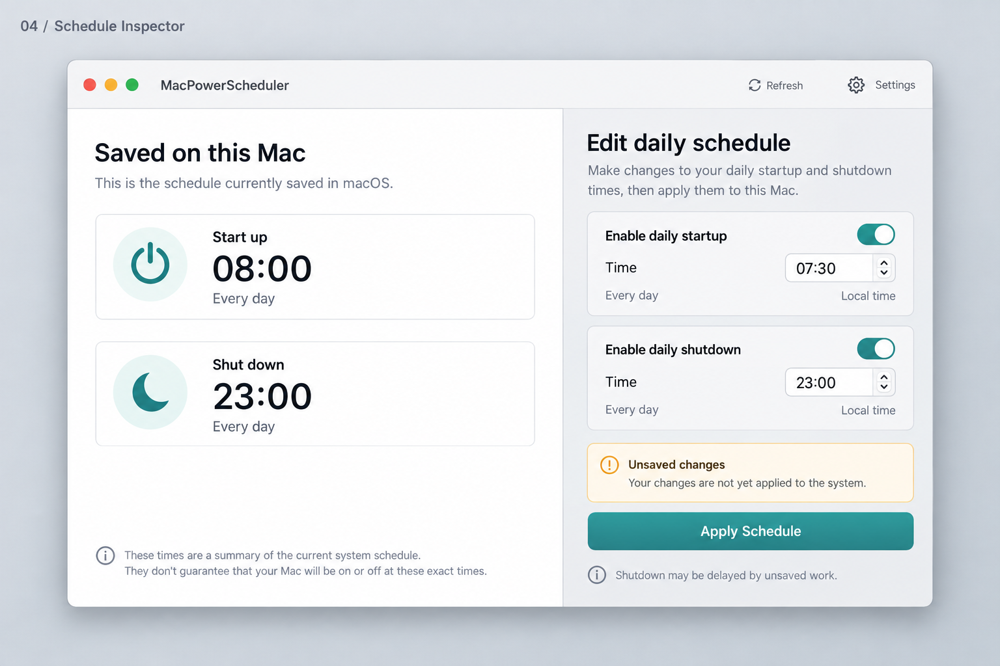
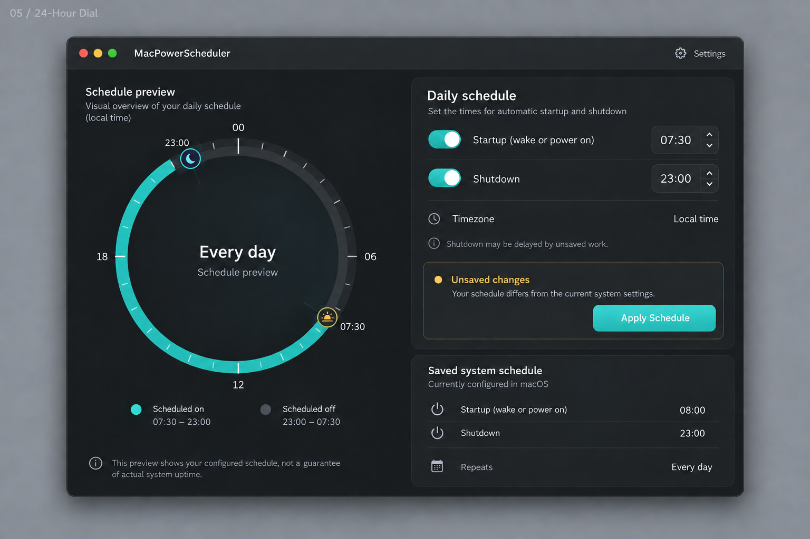
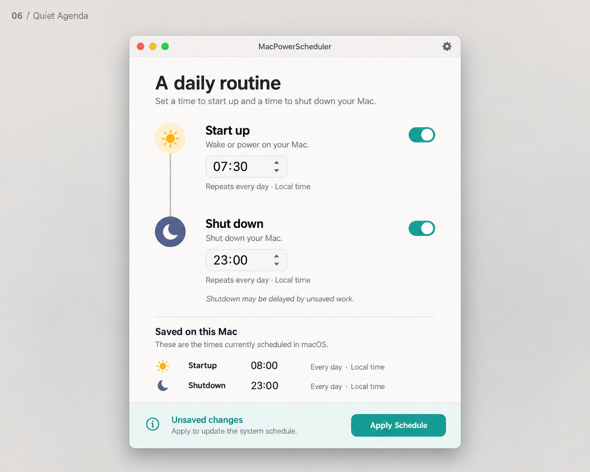

# MacPowerScheduler — six UI directions

Created 2026-09-28. Visual exploration using the imagegen skill and built-in image_gen tool. These are synthetic concept images, not screenshots of implemented behavior. App code and system settings are unchanged.

## Recommendation

**01 Compact Native** best fits the small daily utility: familiar controls, little ceremony, clear separation between the draft and the saved system schedule. **02 Day Timeline** is the strongest more visual alternative. **06 Quiet Agenda** offers a softer, more expressive middle ground.

| Concept | Main idea | Tradeoff |
| --- | --- | --- |
| [01 Compact Native](01-compact-native.png) | Two aligned form rows with a quiet saved-state section | Least expressive, simplest to implement |
| [02 Day Timeline](02-day-timeline.png) | Show the scheduled interval along a 24-hour axis | Needs precise geometry and clear preview semantics |
| [03 Twin Cards](03-twin-cards.png) | Give startup and shutdown equal, prominent controls | Large time fields and cards can feel oversized |
| [04 Schedule Inspector](04-schedule-inspector.png) | Saved state on the left; draft editor on the right | Clearest state distinction, widest layout |
| [05 24-Hour Dial](05-24-hour-dial.png) | Dark interface with circular schedule preview | Distinctive but more custom UI to maintain |
| [06 Quiet Agenda](06-quiet-agenda.png) | Two events joined in a vertical daily routine | Warm and readable, uses more vertical space |

## Research and design rationale

Apple's [Designing for macOS](https://developer.apple.com/design/human-interface-guidelines/designing-for-macos) recommends comfortable information density, familiar Mac interactions, resizable windows, menus and keyboard support. Apply those principles by prioritizing the two scheduling controls, using system typography and native controls, and putting helper and automation management behind Settings while retaining relevant setup/error states on the main screen.

Apple's [Human Interface Guidelines](https://developer.apple.com/design/human-interface-guidelines) and [Design Resources](https://developer.apple.com/design/resources/) are the platform references. The project targets macOS 14, so these concepts do not require newer Liquid Glass APIs.

The [Desktop Calendar App UI Concept by Tamer Mancar](https://dribbble.com/shots/2349917-Desktop-Calendar-App-UI-Concept) was visually inspected for separation of overview and event detail. [Calendar App UI Design by Amit Arora](https://dribbble.com/shots/10726002-Calendar-App-UI-Design) describes a deliberate focus on the calendar's core task; that restraint informed the utility's limited scope. [Mobbin](https://mobbin.com/) was searched as a second UI reference library; its publicly available page highlights settings, sidebar, dialog and other pattern categories. No gated Mobbin screen library was accessed. References are inspiration, not copied layouts.

## Product invariants

All six show independent startup/shutdown switches, editable daily times, explicit Apply Schedule, and distinct saved-system state. Synthetic draft: 07:30 startup and 23:00 shutdown. Synthetic saved state: 08:00 startup and 23:00 shutdown. Automation stays initially disabled in the eventual Settings flow. No weekday editor, profiles, immediate shutdown, fabricated energy statistics, or actual power changes.

The implementation still needs disabled controls, loading/read errors, helper approval, external-change handling, explicit replacement confirmation, automation consent, keyboard navigation, VoiceOver, localization and both appearances. A picture cannot validate these behaviors.

## Visual review and implementation refinements

All six were visually inspected for layout, readable primary text, independent controls, explicit Apply, and the two different schedule states. Concept 05's initially reversed arc was corrected using image generation before saving the final image.

Use neutral styling for ordinary unsaved edits instead of the warning/error treatments in several generated images. In 02, Local time should be informational rather than the generated dropdown affordance; compute timeline positions precisely in code. In 03, change generated “will” claims to “scheduled” and reduce oversized fields. Use locale-aware native time pickers and SF Symbols in the actual app. Keep chart labels descriptive of scheduled events, not guarantees of uptime. These are design directions, not pixel-exact implementation specifications or verified HIG compliance.

No build/test suite was run because application code did not change. Existing snapshots were read only. Six final PNGs and this report are retained here; [generation prompts](prompts.md) accompany them.

## Concepts

### 01 Compact Native

### 02 Day Timeline

### 03 Twin Cards

### 04 Schedule Inspector

### 05 24-Hour Dial

### 06 Quiet Agenda

